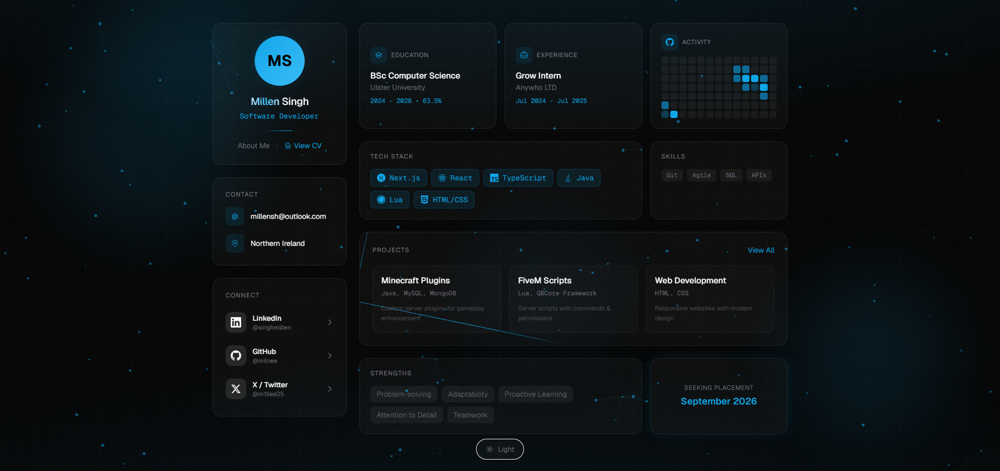
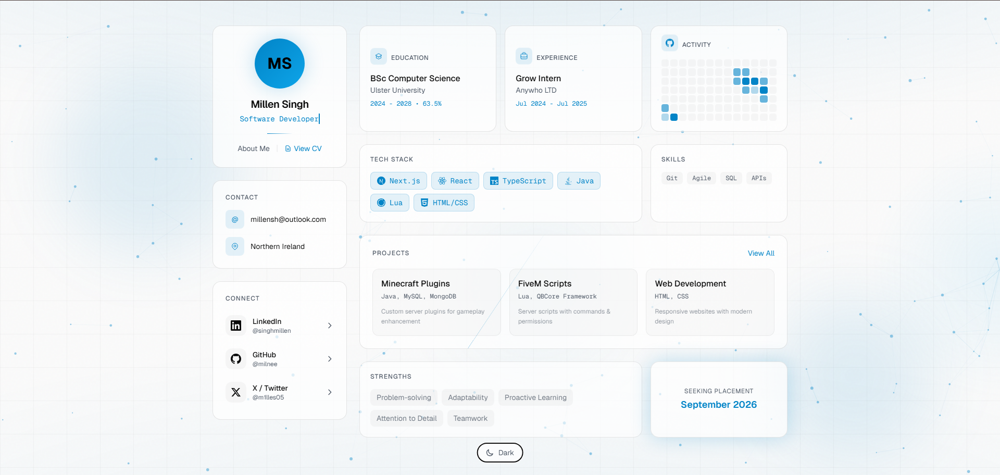

<div align="center">

# millen.sh

My personal portfolio website.

[](https://millen.sh)
[](https://nextjs.org/)
[](https://typescriptlang.org/)

</div>

---



<details>
<summary>Light Mode</summary>



</details>

## Features

- **Particle Background** - Interactive particles that connect on hover
- **Card Spotlight** - Cursor-following glow effect on cards
- **Scroll Animations** - Elements animate in as you scroll
- **Magnetic Buttons** - Buttons subtly pull toward cursor
- **Dark/Light Theme** - Toggle with smooth transitions
- **CV Viewer** - View and download resume as PDF
- **Responsive** - Works on all devices

## Tech Stack

| Technology | Purpose |
|------------|---------|
| Next.js 16 | Framework |
| React 19 | UI Library |
| TypeScript | Type Safety |
| Tailwind CSS | Styling |

## Run Locally

```bash
git clone https://github.com/milnee/Portfolio.git
cd Portfolio
npm install
npm run dev
```

Open [localhost:3000](http://localhost:3000)

## Contact

- **Email** - millensh@outlook.com
- **LinkedIn** - [@singhmillen](https://linkedin.com/in/singhmillen)
- **GitHub** - [@milnee](https://github.com/milnee)
- **X** - [@m1lles05](https://twitter.com/m1lles05)

---

<div align="center">

**[millen.sh](https://millen.sh)**

</div>
