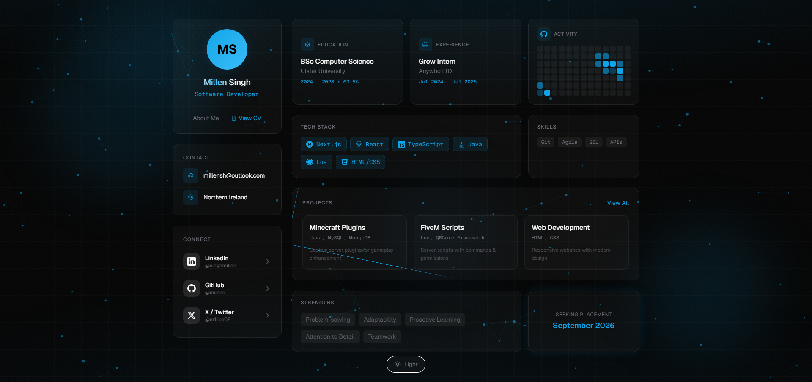

<div align="center">
  <h1>millen.sh</h1>
  <p><strong>Personal portfolio — minimal, fast, and built to last.</strong></p>
  <p>
    <a href="https://millen.sh">Live Site</a> •
    <a href="#features">Features</a> •
    <a href="#getting-started">Getting Started</a> •
    <a href="#tech-stack">Tech Stack</a>
  </p>
  <p>
    
    
    
    
  </p>
</div>

<br />

<p align="center">
  
</p>

## About

A minimal developer portfolio focused on content over decoration. No frameworks, no unnecessary dependencies — just a clean, fast site that lets the work speak for itself.

- **Minimal by design** — dark monospace aesthetic, zero visual noise
- **Fast** — static generation, no client-side bloat
- **Fully responsive** — works on every screen size
- **CV viewer** — built-in PDF viewer so employers can read without downloading

## Features

| | |
|---|---|
| **Projects page** | Curated list of projects with tech stack, links, and dates |
| **CV viewer** | Inline PDF viewer with download option |
| **Email copy** | One-click email copy with visual feedback |
| **Fade-in animations** | Staggered entrance animations on all pages |
| **Monospace typography** | Geist Mono throughout for a consistent developer aesthetic |
| **Mobile responsive** | Fully usable on all devices |

## Getting Started

```bash
# Clone the repository
git clone https://github.com/milnee/Portfolio.git
cd Portfolio

# Install dependencies
bun install

# Start dev server
bun dev
```

Open [http://localhost:3000](http://localhost:3000) in your browser.

## Tech Stack

| Category | Technology |
|---|---|
| Framework | [Next.js 16](https://nextjs.org/) (App Router) |
| Language | [TypeScript 5](https://www.typescriptlang.org/) |
| UI | [React 19](https://react.dev/) |
| Styling | [Tailwind CSS v4](https://tailwindcss.com/) |
| Font | [Geist Mono](https://vercel.com/font) |
| Runtime | [Bun](https://bun.sh/) |
| Hosting | [Vercel](https://vercel.com/) |

## License

MIT License — free for personal and commercial use.

---

<div align="center">
  <p><a href="https://millen.sh">millen.sh</a></p>
</div>
